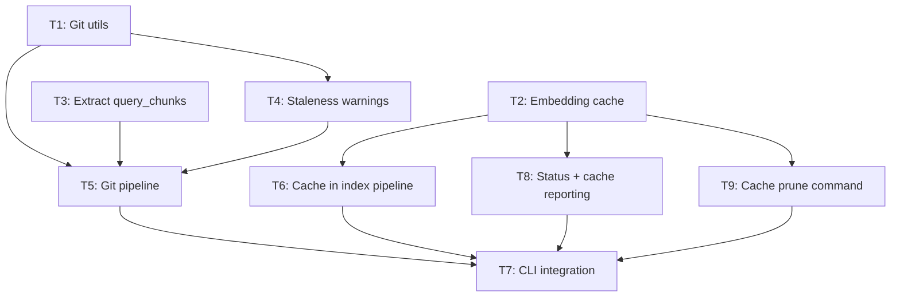

# Architecture: Git Integration

## Codebase Analysis

### Relevant Existing Code
| File | Purpose | Relevance |
|------|---------|-----------|
| `src/core/query_pipeline.rs` | Monolithic query: parse → embed → KNN → rerank → exclusions | Must extract inner loop into shared `query_chunks()` for reuse |
| `src/core/index_pipeline.rs` | Incremental index: parse → upsert → embed → store meta | Add `head_commit` storage + cache integration in embedding loop |
| `src/core/scan_pipeline.rs` | All-pairs scan via KNN | Add staleness warning |
| `src/core/status_pipeline.rs` | Index health report | Add cache size reporting |
| `src/store/db.rs` | DB open/close, migrations, WAL config | Add `open_cache_database()` with cache-specific schema |
| `src/store/index_store.rs` | Function CRUD, KNN queries, embedding storage | `content_hash` already computed on upsert — cache can key on it |
| `src/store/file_tracker.rs` | Incremental change detection (mtime + content hash) | Not directly modified, but git pipeline does analogous comparison |
| `src/util/config.rs` | Project root detection, DB path resolution | Add git-common-dir resolution for cache path |
| `src/util/hash.rs` | SHA-256 utility | Reused for cache content hashing |
| `src/error.rs` | `VibecheckError` enum | Add `Git` variant |
| `src/main.rs` | CLI definition (clap) | Add `Git`, `Commit`, `Cache` subcommands |
| `src/parser/chunker.rs` | Tree-sitter parsing → `FunctionChunk`s | `parse_source()` used to parse both old and new file versions |
| `src/output/types.rs` | `QueryResult`, `StatusResult` types | `StatusResult` needs cache fields |

### Patterns to Follow
- **Pipeline pattern**: Each command has a `core/<name>_pipeline.rs` with an `Options` struct and `run_<name>()` function. Follow this for `git_pipeline.rs`.
- **DB connection lifecycle**: `open_database()` → work → `close_database()` (WAL checkpoint). Apply same to cache connections.
- **Error handling**: `VibecheckError` variants with `thiserror`. String variants for domain errors (`Config`, `Index`, `Ollama`). Add `Git` in the same style.
- **Meta storage**: `index_meta` key-value table for model name, dimensions, etc. Add `head_commit` the same way.
- **Testing**: In-memory SQLite with `run_migrations_for_test()`. Cache tests use `tempfile` for on-disk cache.

### Integration Points
- **Cache ↔ Index pipeline**: Between `get_functions_without_embeddings()` and `embed_batch()` (lines 215-247 of `index_pipeline.rs`). Split unembedded functions into cache hits and misses before calling Ollama.
- **Staleness ↔ Query/Scan**: After opening DB, before running queries. Check `head_commit` in `index_meta` vs `git rev-parse HEAD`.
- **Git pipeline ↔ Query logic**: The extracted `query_chunks()` function is called by both `run_query()` and `run_git()`/`run_commit()`.
- **CLI ↔ Pipelines**: New subcommands in `main.rs` call the new pipeline functions, using the same output formatters as `vibec query`.

## Design

### New Files
- `src/util/git.rs` — Git subprocess wrapper (rev-parse, diff, show)
- `src/store/cache.rs` — Shared embedding cache (open, close, lookup, insert, prune, stats)
- `src/core/git_pipeline.rs` — Git-aware query pipeline (diff → parse → compare → query)

### Modified Files
- `src/core/query_pipeline.rs` — Extract `query_chunks()` shared function
- `src/core/index_pipeline.rs` — Store `head_commit`; integrate cache for embedding lookups
- `src/core/scan_pipeline.rs` — Add staleness warning
- `src/core/status_pipeline.rs` — Add cache reporting
- `src/store/db.rs` — Add `open_cache_database()` + cache schema
- `src/util/config.rs` — Add `resolve_cache_path()`
- `src/error.rs` — Add `Git` variant
- `src/main.rs` — Add `Git`, `Commit`, `Cache Prune` subcommands
- `src/output/types.rs` — Add cache fields to `StatusResult`
- `src/output/formatter.rs` — Format cache info in status output
- `src/lib.rs` — (no change if git_pipeline is under `core/`)
- `src/core/mod.rs` — Add `pub mod git_pipeline;`
- `src/util/mod.rs` — Add `pub mod git;`
- `src/store/mod.rs` — Add `pub mod cache;`

### Contracts & Interfaces

```rust
// === src/util/git.rs ===

/// Check if the current directory is inside a git working tree.
pub fn is_git_repo(project_root: &Path) -> bool;

/// Get the current HEAD commit hash (full 40-char hex).
pub fn get_head_commit(project_root: &Path) -> Result<String, VibecheckError>;

/// Get the git common dir (for shared cache location).
/// Uses `git rev-parse --git-common-dir`.
pub fn get_git_common_dir(project_root: &Path) -> Result<PathBuf, VibecheckError>;

/// File status in a diff.
pub enum DiffStatus { Added, Modified, Deleted }

/// A file entry from a git diff.
pub struct DiffEntry {
    pub path: String,
    pub status: DiffStatus,
}

/// Get changed files: working tree vs HEAD.
/// Runs `git diff HEAD --name-status` (captures staged + unstaged).
pub fn diff_working_tree(project_root: &Path) -> Result<Vec<DiffEntry>, VibecheckError>;

/// Get changed files for a specific commit vs its first parent.
/// Runs `git diff --name-status <hash>^1 <hash>`.
pub fn diff_commit(project_root: &Path, hash: &str) -> Result<Vec<DiffEntry>, VibecheckError>;

/// Get file contents at a specific revision.
/// Runs `git show <rev>:<path>`. Returns None if file doesn't exist at that rev.
pub fn show_file(project_root: &Path, rev: &str, path: &str) -> Result<Option<String>, VibecheckError>;

/// Read file from the working tree (just fs::read_to_string with error wrapping).
pub fn read_working_tree_file(project_root: &Path, path: &str) -> Result<String, VibecheckError>;

/// Check index staleness: compare stored head_commit with current HEAD.
/// Returns a warning string if stale, None if fresh or not a git repo.
pub fn check_staleness(conn: &Connection, project_root: &Path) -> Option<String>;
```

```rust
// === src/store/cache.rs ===

/// Open the shared embedding cache. Creates it if it doesn't exist.
/// Validates settings match (model, dimensions, max_input_bytes) or errors.
/// If `force` is true and settings mismatch, drops and recreates.
pub fn open_cache(
    cache_path: &Path,
    model: &str,
    dimensions: usize,
    max_input_bytes: usize,
    force: bool,
) -> Result<Connection, VibecheckError>;

/// Close the cache connection with WAL checkpoint.
pub fn close_cache(conn: Connection) -> Result<(), VibecheckError>;

/// Batch lookup: given content hashes, return those with cached embeddings.
/// Returns HashMap<content_hash, embedding_bytes>.
pub fn lookup_embeddings(
    conn: &Connection,
    content_hashes: &[&str],
) -> Result<HashMap<String, Vec<u8>>, VibecheckError>;

/// Insert an embedding into the cache.
pub fn insert_embedding(
    conn: &Connection,
    content_hash: &str,
    embedding: &[u8],
) -> Result<(), VibecheckError>;

/// Cache statistics.
pub struct CacheStats {
    pub entry_count: usize,
    pub size_bytes: u64,
}

/// Get cache statistics. Returns None if cache doesn't exist.
pub fn cache_stats(cache_path: &Path) -> Option<CacheStats>;

/// Prune entries not referenced by any worktree's function DB.
/// Discovers worktrees via `git worktree list`, opens each .vibecheck.db,
/// collects all content_hashes in use, deletes unreferenced cache entries.
pub fn prune_cache(
    cache_path: &Path,
    project_root: &Path,
) -> Result<PruneResult, VibecheckError>;

pub struct PruneResult {
    pub entries_removed: usize,
    pub bytes_freed: u64,
}
```

```rust
// === src/core/query_pipeline.rs (extracted) ===

/// Options for the shared query-chunks logic.
pub struct QueryChunkOptions<'a> {
    pub top_k: usize,
    pub threshold: f64,
    pub project_root: &'a Path,
}

/// Core query logic: embed chunks → KNN → rerank → exclusions → build results.
/// Used by both run_query() and the git pipeline.
pub fn query_chunks(
    chunks: &[FunctionChunk],
    conn: &Connection,
    embedder: &dyn Embedder,
    options: &QueryChunkOptions,
) -> Result<(Vec<QueryFunction>, Vec<String>), VibecheckError>;
```

```rust
// === src/core/git_pipeline.rs ===

pub struct GitQueryOptions {
    pub top_k: usize,
    pub threshold: f64,
    pub db_path: Option<String>,
    pub project_root: Option<String>,
    pub ollama: OllamaConfig,
    pub embedder: Option<Box<dyn Embedder>>,
}

pub struct CommitQueryOptions {
    pub hash: String,
    pub top_k: usize,
    pub threshold: f64,
    pub db_path: Option<String>,
    pub project_root: Option<String>,
    pub ollama: OllamaConfig,
    pub embedder: Option<Box<dyn Embedder>>,
}

/// Query uncommitted changes for duplicates.
/// Returns the same QueryResult as vibec query.
pub fn run_git_query(options: GitQueryOptions) -> Result<QueryResult, VibecheckError>;

/// Query a specific commit's changes for duplicates against the current index.
/// Returns the same QueryResult as vibec query.
pub fn run_commit_query(options: CommitQueryOptions) -> Result<QueryResult, VibecheckError>;

// Internal shared logic used by both:

/// Represents the diff analysis for a single file.
struct FileDiff {
    /// Chunks to query (added or modified)
    query_chunks: Vec<FunctionChunk>,
    /// Removed functions for candidate filtering (file_path, function_name)
    removed: Vec<(String, String)>,
}

/// Compare old and new parsed chunks to determine added/modified/removed.
/// Comparison key: (function_name, content_hash).
fn compare_chunks(old: &[FunctionChunk], new: &[FunctionChunk]) -> FileDiff;
```

```rust
// === src/error.rs (addition) ===

#[error("{0}")]
Git(String),
```

```rust
// === src/output/types.rs (StatusResult additions) ===

// Add to StatusResult:
pub cache_exists: bool,
pub cache_path: String,
pub cache_entry_count: usize,
pub cache_size_bytes: u64,
```

### Cache Database Schema

```sql
-- Stored in .git/vibecheck-cache.db
-- Uses user_version for schema versioning (same pattern as main DB)

CREATE TABLE cache_meta (
    key TEXT PRIMARY KEY,
    value TEXT NOT NULL
);
-- Keys: model_name, dimensions, max_input_bytes, created_at

CREATE TABLE embeddings (
    content_hash TEXT PRIMARY KEY,
    embedding BLOB NOT NULL
);
```

### API Shapes

**`run_git_query`**:
- Input: `GitQueryOptions` (top_k, threshold, db_path, project_root, ollama config)
- Output: `QueryResult` (identical to `vibec query` output)
- Errors: `VibecheckError::Git` if not a git repo, no changes, or git subprocess fails

**`run_commit_query`**:
- Input: `CommitQueryOptions` (hash, top_k, threshold, db_path, project_root, ollama config)
- Output: `QueryResult` (identical to `vibec query` output)
- Errors: `VibecheckError::Git` if not a git repo, invalid hash, or git subprocess fails

**`open_cache`**:
- Input: cache path, model settings, force flag
- Output: `Connection`
- Errors: `VibecheckError::Index` on settings mismatch (without force)

**`prune_cache`**:
- Input: cache path, project root (for worktree discovery)
- Output: `PruneResult` (entries removed, bytes freed)
- Errors: `VibecheckError::Git` if not a git repo

## Task Breakdown

### Task Dependency Graph


### Tasks

#### T1: Git subprocess utilities
- **Files**: `src/util/git.rs`, `src/util/mod.rs`, `src/error.rs`
- **Depends on**: none
- **Parallel**: yes (with T2, T3)
- **Description**: Create `util/git.rs` with all git subprocess wrappers: `is_git_repo`, `get_head_commit`, `get_git_common_dir`, `diff_working_tree`, `diff_commit`, `show_file`, `read_working_tree_file`, `check_staleness`. Add `Git(String)` variant to `VibecheckError`. All functions run `git` via `std::process::Command`, parse stdout, and map stderr to `VibecheckError::Git`. Include unit tests for output parsing (mock git output).

#### T2: Shared embedding cache
- **Files**: `src/store/cache.rs`, `src/store/db.rs`, `src/store/mod.rs`, `src/util/config.rs`
- **Depends on**: none
- **Parallel**: yes (with T1, T3)
- **Description**: Create `store/cache.rs` with `open_cache`, `close_cache`, `lookup_embeddings`, `insert_embedding`, `cache_stats`. Add `open_cache_database()` to `db.rs` — same WAL + busy_timeout config but with cache-specific schema migrations (cache_meta + embeddings tables). Add `resolve_cache_path()` to `config.rs` that calls `git rev-parse --git-common-dir` and appends `vibecheck-cache.db`. Settings validation: on open, check `cache_meta` for model/dimensions match; error on mismatch unless force. Include tests with tempfile-based cache DBs.

#### T3: Extract `query_chunks()` from query pipeline
- **Files**: `src/core/query_pipeline.rs`
- **Depends on**: none
- **Parallel**: yes (with T1, T2)
- **Description**: Extract lines 88-158 of `run_query` into a standalone `query_chunks()` function that takes pre-parsed `FunctionChunk`s, a DB connection, an embedder, and query options. Refactor `run_query` to call `query_chunks`. This is a pure refactor — existing tests and behavior must not change. Run `cargo test` to verify.

#### T4: Staleness warnings
- **Files**: `src/core/index_pipeline.rs`, `src/core/query_pipeline.rs`, `src/core/scan_pipeline.rs`
- **Depends on**: T1
- **Parallel**: yes (with T2-parallel work, T6)
- **Description**: In `index_pipeline.rs`, store `head_commit` in `index_meta` after successful index (only if `is_git_repo`). In `query_pipeline.rs` and `scan_pipeline.rs`, call `check_staleness()` after opening DB and add any warning to the warnings vec. Graceful: if not a git repo or `head_commit` absent, no warning. Include test for staleness detection logic.

#### T5: Git pipeline (core feature)
- **Files**: `src/core/git_pipeline.rs`, `src/core/mod.rs`
- **Depends on**: T1, T3, T4
- **Parallel**: no
- **Description**: Create `git_pipeline.rs` with `run_git_query` and `run_commit_query`. Internal flow:
  1. Validate git repo (error if not)
  2. Get diff entries (working tree or commit)
  3. Filter to supported file extensions (via `registry::language_for_file`)
  4. For each changed file (Added/Modified): parse old version + new version via `parse_source`
  5. `compare_chunks()`: match by `(function_name)`, classify as added/modified/removed using content hash comparison
  6. Collect all query chunks + build removed set as `HashSet<(String, String)>` (file_path, function_name)
  7. Call `query_chunks()` with the collected chunks
  8. Post-filter: remove candidates where `(candidate.path, candidate.name)` is in the removed set
  9. Add staleness warning
  10. Return `QueryResult`

#### T6: Integrate cache into index pipeline
- **Files**: `src/core/index_pipeline.rs`
- **Depends on**: T2
- **Parallel**: yes (with T4, T5)
- **Description**: In the embedding loop of `run_index`, after `get_functions_without_embeddings`:
  1. If in a git repo, resolve cache path and open cache
  2. Batch-lookup content hashes in cache
  3. For cache hits: call `update_embedding` directly with cached bytes (skip Ollama)
  4. For cache misses: embed via Ollama as before, then write to cache
  5. Close cache connection
  6. Non-git: skip cache entirely, existing behavior unchanged

#### T7: CLI integration
- **Files**: `src/main.rs`
- **Depends on**: T5, T6, T8, T9
- **Parallel**: no
- **Description**: Add clap subcommands:
  - `Git` — args: `top_k`, `threshold`, `json`
  - `Commit` — args: `hash` (positional), `top_k`, `threshold`, `json`
  - `Cache Prune` — args: `json`
  Wire each to its pipeline function. Use existing `format_human`/`format_json` for query output. Add cache prune output formatting.

#### T8: Status pipeline cache reporting
- **Files**: `src/core/status_pipeline.rs`, `src/output/types.rs`, `src/output/formatter.rs`
- **Depends on**: T2
- **Parallel**: yes (with T4, T5, T6)
- **Description**: Add `cache_exists`, `cache_path`, `cache_entry_count`, `cache_size_bytes` fields to `StatusResult`. In `run_status`, resolve cache path (if git repo), call `cache_stats()`, populate fields. Update human and JSON formatters to include cache info.

#### T9: Cache prune command
- **Files**: `src/store/cache.rs` (add `prune_cache`), `src/core/git_pipeline.rs` or standalone
- **Depends on**: T2
- **Parallel**: yes (with T4, T5, T6)
- **Description**: Implement `prune_cache`:
  1. Run `git worktree list --porcelain` to discover all worktree paths
  2. For each worktree, check if `.vibecheck.db` exists; if so, open it and collect all `content_hash` values from the `functions` table
  3. Union all collected hashes
  4. Delete from `embeddings` table where `content_hash NOT IN (collected set)`
  5. Return count and bytes freed (measure DB size before/after or count rows deleted)

## Test Strategy

- **T1 (git utils)**: Unit tests for git output parsing. Test `check_staleness` with mock `index_meta` values.
- **T2 (cache)**: Unit tests with tempfile DBs: open/close, lookup hit/miss, insert, settings mismatch error, force rebuild.
- **T3 (query_chunks extraction)**: Existing query pipeline tests must continue to pass unchanged. This is a refactor-only task.
- **T4 (staleness)**: Test that `head_commit` is stored after index. Test warning is generated when stored != current. Test no warning when absent.
- **T5 (git pipeline)**: Test `compare_chunks` logic: added, modified, removed, unchanged classifications. Test removed-function filtering on query results. Integration tests with tempfile git repos would be ideal but may be deferred.
- **T6 (cache integration)**: Test that cache hits skip Ollama calls. Test that cache misses are written. Test non-git fallback.
- **T7 (CLI)**: Manual testing / smoke tests. Clap derives are tested by compilation.
- **T8 (status)**: Test that `StatusResult` includes cache fields. Test non-git case.
- **T9 (prune)**: Test with known cache entries and mock worktree DBs.

## Decisions

- **D4**: `query_chunks()` is extracted from `query_pipeline.rs` rather than having the git pipeline re-implement query logic. This satisfies constraint C-3 and keeps behavior consistent.
- **D5**: The git pipeline produces `QueryResult` (same type as `vibec query`), not a new result type. Existing formatters work unchanged.
- **D6**: `compare_chunks` matches functions by `function_name` within a file and uses `content_hash` to detect modifications. This is simpler than AST-based comparison and sufficient for the use case.
- **D7**: MCP server integration for `vibec git`/`vibec commit` is deferred — CLI-only in v1.
- **D8**: No new Cargo dependencies needed. Git interaction uses `std::process::Command`.
- **D9**: Cache prune discovers worktrees via `git worktree list --porcelain` and cross-references all their `.vibecheck.db` files to determine which embeddings are still in use.
